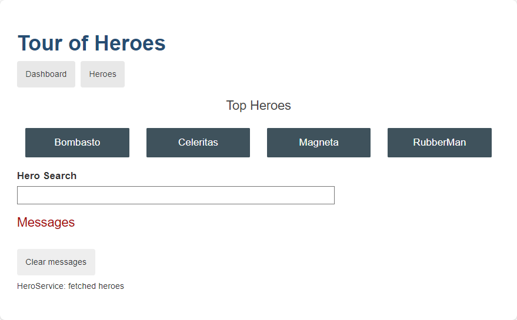

# 02 - Tour of Heroes

## Description
This *Tour of Heroes* tutorial provides an introduction to the fundamentals of Angular and shows you how to:
- Set up your local Angular development environment.
- Use the Angular CLI to develop an application.

The *Tour of Heroes* application that you build helps a staffing agency manage its stable - of heroes. The application has many of the features that you'd expect to find in any data-driven application.

The finished application:
- Gets a list of heroes
- Displays the heroes in a list
- Edits a selected hero's details
- Navigates between different views of heroic data

## Screenshot



## Usage

### Install the correct version of node.js for Angular
If you do not have a version of `node.js`` installed, please follow the directions for [installation on nodejs.org](https://nodejs.org/en/download/)

### Install Angular CLI
With `node.js` and `npm` installed, the next step is to install the [Angular CLI](https://angular.io/cli) which provides tooling for effective Angular development.

### Install integrated development environment (IDE)

You are free to use any tool you prefer to build apps with Angular. We recommend the following:

- [Visual Studio Code](https://code.visualstudio.com/)
- As an optional, but recommended step you can further improve your developer experience by installing the [Angular Language Service](https://marketplace.visualstudio.com/items?itemName=Angular.ng-template)

### Clone the repository

```bash
git clone https://github.com/tsjdev-apps/angular-playground.git
cd angular-playground/02-tour-of-heroes
```

### Install dependencies

```bash
npm install
```

### Run the application

```bash
ng serve
```

You should now be able to view the app in your browser at http://localhost:4200.